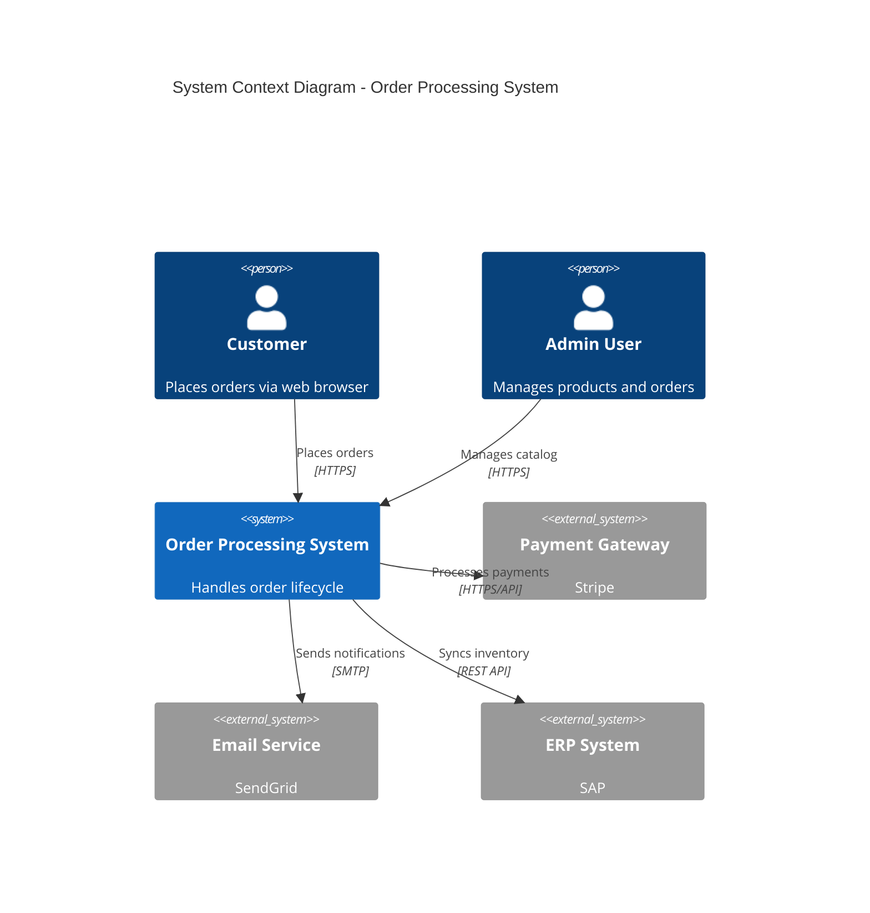
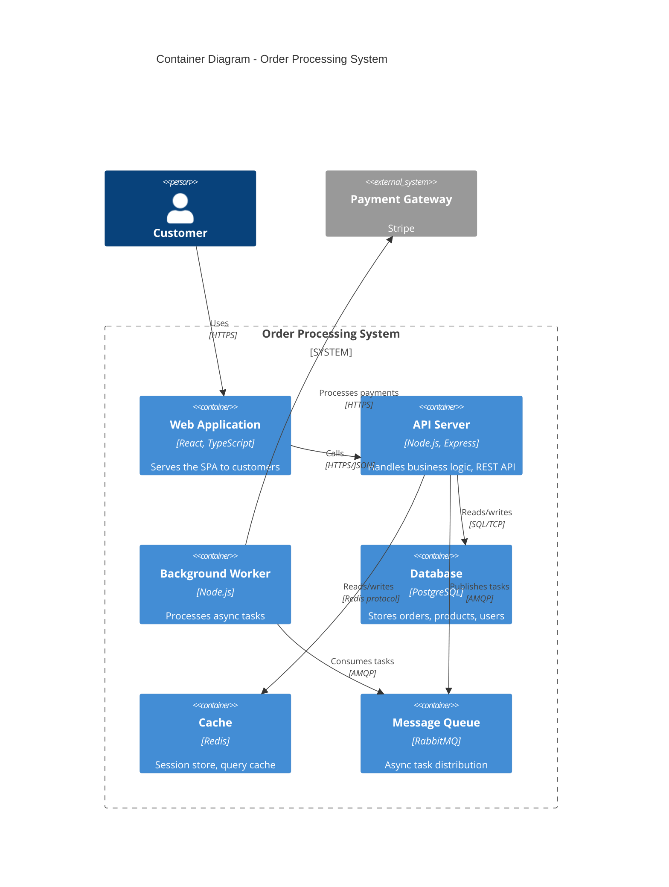
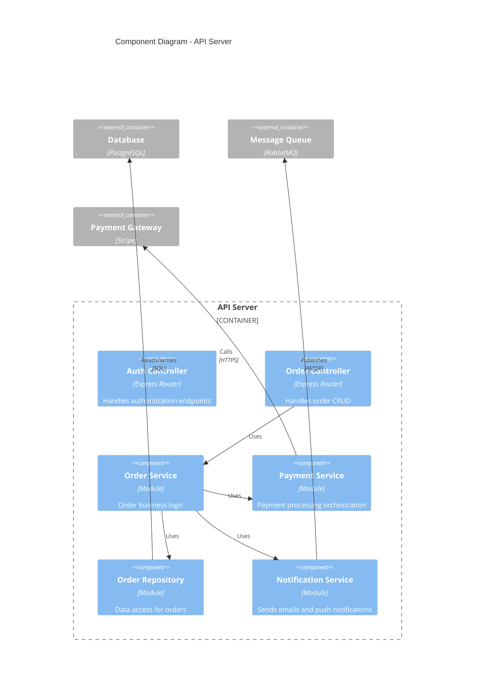

# Software Architecture Documentation Best Practices

A practical reference guide for producing and maintaining architecture documentation. Draws on established practices from Michael Nygard, Simon Brown (C4 Model), the arc42 project, Martin Fowler, ThoughtWorks Technology Radar, IEEE/SEI, and industry practitioners at Google, Uber, Spotify, and others.

---

## 1. Architecture Decision Records (ADRs)

### What They Are

An Architecture Decision Record is a short document that captures a single architectural decision along with its context and consequences. The concept was popularized by Michael Nygard in his 2011 blog post "Documenting Architecture Decisions." ADRs are stored alongside code (typically in `docs/adr/` or `docs/decisions/`) and are numbered sequentially.

ADRs answer the question that haunts every engineer joining a project: **"Why was it built this way?"**

### Why They Matter

- **Institutional memory.** Teams lose context when people leave. ADRs preserve the reasoning, not just the outcome.
- **Onboarding accelerator.** New team members can read the decision log to understand the system's evolution.
- **Prevents re-litigation.** When someone asks "why don't we just use X?", the ADR explains what was considered and why it was rejected.
- **Lightweight governance.** ADRs provide accountability without heavyweight review boards.

### The Nygard Format (Original)

The original format is deliberately minimal:

```markdown
# ADR {NUMBER}: {TITLE}

## Status
{Proposed | Accepted | Deprecated | Superseded by ADR-XXXX}

## Context
What is the issue that we're seeing that is motivating this decision or change?

## Decision
What is the change that we're proposing and/or doing?

## Consequences
What becomes easier or more difficult to do because of this change?
```

**Why this format works:** It forces brevity. Each section has a clear purpose. The "Consequences" section is the most valuable part — it forces the author to think about tradeoffs honestly.

### MADR Format (Markdown Any Decision Records)

MADR extends Nygard's format with structured options analysis. Use this when multiple alternatives were seriously considered:

```markdown
# {TITLE}

## Status
{Proposed | Accepted | Deprecated | Superseded}

## Context and Problem Statement
{Describe the context and problem in 2-3 sentences}

## Decision Drivers
- {Driver 1, e.g., "Must support horizontal scaling"}
- {Driver 2, e.g., "Team has deep PostgreSQL expertise"}

## Considered Options
1. {Option A}
2. {Option B}
3. {Option C}

## Decision Outcome
Chosen option: "{Option B}", because {justification}.

### Positive Consequences
- {e.g., "Simpler operational model"}

### Negative Consequences
- {e.g., "Requires migration of existing data"}

## Pros and Cons of the Options

### {Option A}
- (+) {Pro}
- (-) {Con}

### {Option B}
- (+) {Pro}
- (-) {Con}

## Links
- {Link to related ADR, RFC, issue, or discussion}
```

### When to Write an ADR

**Write an ADR when:**
- Choosing between competing technologies, frameworks, or libraries
- Deciding on a communication pattern (sync vs async, REST vs gRPC)
- Defining data storage strategy (SQL vs NoSQL, single vs polyglot)
- Establishing a cross-cutting convention (error handling, logging, auth approach)
- Making a decision that would be costly to reverse
- The team has a disagreement and needs to converge

**Skip the ADR when:**
- The decision is easily reversible (e.g., choosing a linting config)
- It follows directly from a previous ADR (just reference the original)
- It is a local implementation detail that does not affect the system boundary
- The team unanimously agrees and the decision is obvious given the context

### Common ADR Mistakes

| Mistake | Why It Hurts | Fix |
|---------|-------------|-----|
| Too detailed / essay-length | Nobody reads a 3-page ADR | Keep Context and Decision to 1-3 paragraphs each |
| Too vague ("we decided to use a database") | Provides no actual decision rationale | State the specific choice and the specific alternatives rejected |
| Not recording "Rejected" status | Zombie decisions linger | Use status transitions: Proposed -> Accepted/Rejected -> Superseded |
| Missing consequences section | Loses the most valuable information (tradeoffs) | Always list at least one positive and one negative consequence |
| Not maintained | New decisions contradict old ones silently | Supersede old ADRs explicitly; review during architecture reviews |
| Written after the fact as justification | Rationalizes rather than records genuine reasoning | Write at decision time, even as "Proposed" while discussing |

### Linking ADRs to the Architecture Doc

- Reference ADRs by number in the architecture document where relevant (e.g., "See ADR-007 for the rationale behind choosing event sourcing").
- Maintain an ADR index (a simple table or list) in the architecture doc or a dedicated `docs/adr/README.md`.
- Group ADRs by architectural concern (data, integration, deployment, security) in the index.
- In the architecture doc, link from each significant component or pattern to the ADR that justified it.

---

## 2. C4 Model (Simon Brown)

### Overview

The C4 model is a hierarchical approach to diagramming software architecture, created by Simon Brown. It uses four levels of abstraction, each zooming in further. The name "C4" comes from the four levels: **Context, Containers, Components, Code**.

The key insight: **different audiences need different levels of detail, and a single diagram trying to show everything helps nobody.**

### The Four Levels

#### Level 1: System Context Diagram

**What it shows:** Your system as a box in the center, surrounded by the users (people) and other systems it interacts with.

**Audience:** Everyone — developers, architects, PMs, executives, stakeholders.

**Key rules:**
- Your system is ONE box. Do not decompose it at this level.
- Show people (actors/roles) and external systems only.
- Label every relationship with its purpose (e.g., "Sends order confirmation emails via", "Reads customer data from").
- Typically fits on a single page.

**Mermaid mapping:**


#### Level 2: Container Diagram

**What it shows:** The high-level technology building blocks inside your system — applications, data stores, message queues, file systems. A "container" in C4 is NOT a Docker container; it is a separately deployable/runnable unit.

**Audience:** Developers, architects, operations/DevOps.

**Key rules:**
- Each container has a name, technology choice, and responsibility.
- Show the communication protocols between containers (HTTP, gRPC, AMQP, etc.).
- Include data stores as containers.
- Show external systems from Level 1 as grey boxes for context.

**Mermaid mapping:**


#### Level 3: Component Diagram

**What it shows:** The major structural building blocks inside a single container — services, controllers, repositories, modules.

**Audience:** Developers working on that specific container.

**Key rules:**
- Only draw this for containers that are complex enough to warrant it.
- Show the major components, their responsibilities, and interactions.
- This level often maps to top-level packages/modules/namespaces.
- **Most projects only need this for 1-2 key containers**, not all of them.

**Mermaid mapping:**


#### Level 4: Code Diagram

**What it shows:** Class diagrams, entity-relationship diagrams, or detailed code structure.

**Audience:** Developers deep in implementation.

**Key rules:**
- **Almost never draw this manually.** If needed, generate it from code.
- Use IDE tooling or auto-generation.
- This level is rarely included in architecture documents — the code itself is the documentation at this level.
- Only create for exceptionally complex algorithms, state machines, or data models that are hard to understand from code alone.

### Common C4 Mistakes

| Mistake | Fix |
|---------|-----|
| Going to Level 3/4 before Level 1 is solid | Start with Context. If you cannot draw Level 1, you do not understand your system's boundaries. |
| Mixing abstraction levels in one diagram | Never show containers AND components in the same diagram. Each diagram is one level. |
| Labeling arrows with technology only ("HTTPS") | Label with purpose AND technology ("Sends order events via HTTPS"). |
| Showing every internal class as a "component" | Components are coarse-grained modules, not individual classes. |
| Making Level 2 too granular | If your container diagram has 30+ boxes, you may be mixing containers with components. |
| Not showing external systems | Always include external dependencies for context. Grey them out to distinguish from your system. |
| Using C4 notation but ignoring the methodology | C4 is about abstraction levels, not just box shapes. The hierarchy matters more than the notation. |

### Practical C4 Guidance

- **Every project should have Level 1 and Level 2.** These two diagrams cover 80% of communication needs.
- **Level 3 is optional** and should only exist for complex containers (e.g., a monolith with many modules, a complex API layer).
- **Level 4 is almost always auto-generated** or skipped entirely.
- **Update diagrams when containers are added or removed**, not on every code change.
- Store diagram source (Mermaid, PlantUML, Structurizr DSL) alongside the code so they are version-controlled and diffable.

---

## 3. arc42 Template

### Overview

arc42 is a practical, open-source template for software architecture documentation, created by Gernot Starke and Peter Hruschka. It provides 12 sections that can be used selectively based on project needs. The key principle: **you do not have to fill every section.** Use what adds value, skip what does not.

### The 12 Sections

| # | Section | What It Covers | Priority |
|---|---------|---------------|----------|
| 1 | **Introduction and Goals** | Business requirements, quality goals, stakeholders | Essential |
| 2 | **Constraints** | Technical, organizational, and regulatory constraints | Essential |
| 3 | **Context and Scope** | System boundary, external interfaces (maps to C4 Level 1) | Essential |
| 4 | **Solution Strategy** | Fundamental technology decisions and solution approach | Essential |
| 5 | **Building Block View** | Static decomposition of the system (maps to C4 Levels 2-3) | Essential |
| 6 | **Runtime View** | Key scenarios showing how building blocks interact at runtime | Important |
| 7 | **Deployment View** | Infrastructure, environments, deployment topology | Important |
| 8 | **Crosscutting Concepts** | Patterns and conventions used across the system (error handling, logging, security, persistence) | Important |
| 9 | **Architecture Decisions** | Key decisions and their rationale (ADRs live here or are referenced) | Essential |
| 10 | **Quality Requirements** | Quality tree and quality scenarios (performance, availability, security targets) | Important |
| 11 | **Risks and Technical Debt** | Known risks, unresolved issues, technical debt items | Important |
| 12 | **Glossary** | Domain terms and technical terms used in the documentation | Useful |

### Scaling arc42 to Project Size

**Small project (1-5 developers, single service):**
- Sections 1, 3, 4, 5, 9 — enough for a solid single-page architecture doc
- Skip: Runtime View, Deployment View (if trivial), Quality Requirements (if informal)

**Medium project (5-20 developers, multiple services):**
- Sections 1-9 — cover all the structural and decision content
- Add Section 10 if there are explicit SLAs or quality targets
- Add Section 11 if accumulating known tech debt

**Large project (20+ developers, complex distributed system):**
- All 12 sections, but keep each concise
- Runtime View becomes critical for understanding complex interactions
- Deployment View essential for multi-environment, multi-region setups
- Quality Requirements essential for contractual obligations

### arc42 vs Other Templates

| Template | Strengths | When to Prefer |
|----------|-----------|----------------|
| **arc42** | Comprehensive yet modular; well-documented; large community; works for any tech stack | General-purpose; when you want a proven structure that scales |
| **C4 + ADRs only** | Minimal, diagram-focused; low ceremony | Small teams, microservices, when diagrams + decisions are sufficient |
| **IEEE 1471 / ISO 42010** | Formal, stakeholder-viewpoint-driven; rigorous | Regulated industries, contractual requirements, large enterprise |
| **Rozanski & Woods (viewpoints)** | Systematic viewpoint coverage; good for non-functional concerns | Systems with complex quality attribute requirements |

### Keeping arc42 Lean

- **Start with a single file.** Do not create 12 separate documents for a small project. A single ARCHITECTURE.md with headers for each relevant section works.
- **Two sentences beat zero sentences.** A sparse section is better than a missing section. Write what you know now and expand later.
- **Use diagrams over prose.** A Container Diagram replaces paragraphs of text about system structure.
- **Link, do not duplicate.** If ADRs are in `docs/adr/`, reference them from Section 9 rather than copying content.
- **Delete empty sections.** If a section adds no value, remove it rather than leaving a "TODO" that will never be filled.

---

## 4. RFC / Design Document Process

### When to Write an RFC vs Just Building

**Write an RFC when:**
- The change affects multiple teams or services
- The decision is difficult to reverse (data model changes, API contracts, infrastructure choices)
- The solution space is genuinely uncertain and alternatives need evaluation
- The change has significant cost, risk, or timeline implications
- You want to build consensus before investing implementation effort
- New engineers would benefit from understanding the design rationale later

**Just build when:**
- The change is well-understood and localized to one component
- The team has strong consensus already
- It is faster to prototype than to write about it (and the prototype is disposable)
- The change is easily reversible
- A PR description provides sufficient documentation of the change

### RFC Structure (Practical Template)

```markdown
# RFC: {TITLE}

**Author(s):** {names}
**Status:** {Draft | In Review | Accepted | Rejected | Superseded}
**Created:** {date}
**Last Updated:** {date}

## Summary
{One paragraph. What are you proposing and why?}

## Problem Statement
{What problem exists today? Who is affected? What is the impact?
Be specific with data if possible: "P99 latency is 4.2s, target is 500ms."}

## Proposed Solution
{Describe the solution at the architectural level. Include diagrams.
Focus on the "what" and "why", not implementation minutiae.}

### Key Design Decisions
{Call out the important choices within the solution and their rationale.}

## Alternatives Considered
{For each serious alternative:}
### Alternative A: {Name}
- Description: {Brief description}
- Pros: {Why it could work}
- Cons: {Why it was not chosen}

## Risks and Mitigations
{What could go wrong? How will you detect and address it?}

## Migration / Rollout Plan
{How do you get from here to there? Phased rollout? Feature flags? Data migration?}

## Open Questions
{What is not yet decided? What feedback do you need?}

## References
{Links to prior art, related RFCs, relevant documentation}
```

### Industry Approaches

**Google (Design Docs):**
- Lightweight, typically 3-10 pages
- Shared in Google Docs for inline commenting
- Required for any project expected to take more than one engineer-week
- Explicitly lists non-goals ("This design doc does NOT address...")
- Includes a "Background" section for readers who lack context
- Reviewed by relevant tech leads; approval is explicit

**Uber (RFC Process):**
- Uses a formal RFC process for cross-team or platform-level changes
- RFCs have a designated "shepherd" who drives the review process
- Time-boxed review period (typically 1-2 weeks)
- Final decision documented even if the RFC is rejected

**Spotify (Decentralized):**
- Lightweight "tech proposals" within squads
- Broader "Spotify Engineering Proposals" (SEPs) for platform-level changes
- Strong emphasis on autonomous squad decision-making

**Amazon (Six-Pager / PR FAQ):**
- Narrative format rather than bullet points — forces clear thinking
- Starts from the customer experience and works backward
- "PR FAQ" format for new features: write the press release first, then the FAQ

### Getting Useful Feedback on Design Docs

- **Name specific reviewers and what you want from each.** ("Alice: please review the database migration plan. Bob: please challenge the API design.")
- **Set a review deadline.** Open-ended reviews never complete. One to two weeks is typical.
- **Highlight open questions.** Reviewers focus better when they know where uncertainty lies.
- **Share early, share rough.** A 60% draft with honest "I am not sure about X" gets better feedback than a polished document that implies finality.
- **Distinguish blocking vs advisory feedback.** Not all comments require resolution before proceeding.
- **Summarize the decision.** After review, update the RFC with a "Decision" section capturing the outcome and key discussion points.

---

## 5. Documentation Anti-patterns

### Documents That Are Too Long

**Symptom:** 50+ page architecture docs that nobody reads.

**Root cause:** Treating the architecture doc as a comprehensive specification rather than a communication tool.

**Fix:**
- Architecture docs should be 5-15 pages for most systems.
- Use a layered approach: executive summary (1 page) -> architecture overview (3-5 pages) -> deep dives (separate docs, linked).
- Ruthlessly cut content that is not architectural (implementation guides, API reference, operational runbooks belong elsewhere).
- Apply the "new hire test": if a senior engineer joining the team cannot read it in under an hour and have a useful mental model of the system, it is too long.

### Documents That Are Too Short

**Symptom:** A README with "We use React and PostgreSQL" and nothing else.

**Root cause:** The team assumes everyone shares the same context.

**Fix:**
- At minimum, capture: system purpose, major components, key technology choices with rationale, and how components communicate.
- Use the "bus factor test": if the senior architect left tomorrow, would the remaining team understand why the system is built this way?

### Over-Specification (Designing Before Understanding)

**Symptom:** Detailed architecture documents written before the problem is well understood. Extensive diagrams for systems that have not been built. Premature technology selection documented as decisions.

**Root cause:** Waterfall mindset applied to architecture. Desire for certainty before action.

**Fix:**
- Document what you know now with honest markers for uncertainty.
- Use ADRs with "Proposed" status for decisions that are not yet validated.
- Prefer thin, evolutionary documentation that grows with the system.
- Mark assumptions explicitly: "We assume traffic will not exceed 10K requests/second in the first year."

### "Write Once, Never Update" Syndrome

**Symptom:** Architecture doc was written six months ago. Three services have been added, one has been decommissioned, and the database was migrated. The doc still describes the original design.

**Root cause:** Documentation is treated as a one-time deliverable rather than a living artifact.

**Fix:**
- Tie documentation updates to architecture changes: when you add a service, update the container diagram.
- Include documentation review in the definition of done for architecture-significant changes.
- Use lightweight automated checks (see Living Documentation section).
- Accept that the doc will lag slightly — it does not need real-time accuracy, but it must be close enough to be trustworthy.

### Missing the "Why"

**Symptom:** The document says "We use Kafka for event streaming" but not why Kafka was chosen over RabbitMQ, Pulsar, or direct HTTP calls.

**Root cause:** Documenting decisions as facts rather than as choices made in a context.

**Fix:**
- Every technology choice should have a brief rationale, even if it is one sentence: "Kafka was chosen for its durability guarantees and the team's existing operational experience."
- Use ADRs for significant decisions and inline rationale for smaller ones.
- Capture rejected alternatives — they are as valuable as the chosen option.

### Diagrams That Confuse Instead of Clarify

**Symptom:** A single diagram with 40 boxes, crossing lines, mixed abstraction levels, inconsistent notation, and no legend.

**Root cause:** Trying to show everything in one diagram. Using diagrams as decoration rather than communication.

**Fix:**
- One diagram, one abstraction level (follow C4).
- Maximum 15-20 elements per diagram. If you have more, decompose into sub-diagrams.
- Every box needs a label and a brief description of its responsibility.
- Every arrow needs a label describing what flows across it.
- Use consistent notation and include a legend if using custom symbols.
- Use color intentionally (e.g., green for your system, grey for external) rather than decoratively.

---

## 6. Living Documentation

### How to Keep Architecture Docs Up to Date

**Process-based approaches:**
- **Architecture review checklist.** Add "Is ARCHITECTURE.md still accurate?" to the PR review checklist for PRs that add/remove services, change data stores, or modify system boundaries.
- **Periodic review cadence.** Schedule a quarterly 30-minute review of the architecture doc. Flag stale sections. This is more realistic than real-time updates.
- **Architecture decision trigger.** Any PR that introduces a new dependency, service, or integration pattern should reference or create an ADR.
- **Ownership.** Assign a rotating "architecture doc maintainer" role (e.g., monthly rotation among senior engineers). Clear ownership prevents diffusion of responsibility.

### Architecture Fitness Functions

Fitness functions (from "Building Evolutionary Architectures" by Ford, Parsons, and Kua) are automated checks that verify architectural properties are maintained over time. They serve as executable documentation of architectural intent.

**Examples:**
- **Dependency constraints:** ArchUnit (Java), Dependency-Cruiser (JS/TS), or custom lint rules that enforce "module A must not depend on module B."
- **Layer violations:** Automated tests that verify the presentation layer does not directly access the database.
- **API compatibility:** Contract tests (Pact, Protolock) that verify API changes are backward-compatible.
- **Performance budgets:** Automated performance tests that fail if P95 latency exceeds a threshold.
- **Security scanning:** Automated checks for known vulnerabilities, exposed secrets, or insecure configurations.

**How they relate to documentation:** Fitness functions are the executable counterpart of architectural constraints. When you document "the API layer must not directly access the database," back it up with a fitness function that enforces it. The constraint is documented in the architecture doc; the enforcement is in the test suite.

### Docs-as-Code Approach

**Principles:**
- Store documentation in the same repository as the code it describes.
- Use plain text formats (Markdown, AsciiDoc) that are diffable and version-controlled.
- Use diagrams-as-code (Mermaid, PlantUML, Structurizr DSL) rather than binary diagram files (Visio, Lucidchart exports).
- Review documentation changes in the same PR as the code changes they relate to.
- Apply CI checks: lint Markdown, validate Mermaid diagrams render, check for broken internal links.

**Benefits:**
- Documentation and code are always in the same commit, making it easy to see what the system looked like at any point in history.
- PRs that change architecture without updating documentation are visible in code review.
- Branching and merging work naturally — documentation follows the code.

**Tooling:**
- Mermaid: renders natively in GitHub, GitLab, and most Markdown renderers. Best for C4 diagrams, sequence diagrams, flowcharts.
- PlantUML: more expressive than Mermaid but requires a rendering server. Better for complex UML.
- Structurizr DSL: purpose-built for C4 diagrams. Best when C4 is the primary notation.
- MkDocs / Docusaurus: generate a browsable documentation site from Markdown files in the repo.

### When to Document vs When to Let Code Speak

**Document when:**
- The "why" is not obvious from the code (architectural rationale, business context, rejected alternatives).
- The system-level structure is not visible from any single code file (how services communicate, deployment topology).
- Cross-cutting decisions affect multiple parts of the codebase (conventions, patterns, standards).
- The audience includes non-developers (PMs, executives) who will not read code.

**Let code speak when:**
- The implementation is straightforward and follows well-known patterns.
- Good naming, clear module structure, and well-written tests already communicate intent.
- API documentation can be generated from code (OpenAPI/Swagger, GraphQL schema, type definitions).
- The detail is at C4 Level 4 — code IS the documentation at this granularity.

**The rule of thumb:** Document structure, decisions, and rationale. Let code document implementation.

---

## 7. Audience-Aware Documentation

### What Different Stakeholders Need

| Stakeholder | Needs | Appropriate Depth | Format |
|-------------|-------|-------------------|--------|
| **New hire (developer)** | System overview, how to navigate the codebase, why key decisions were made, how to set up locally | Medium — enough to build a mental model in their first week | Architecture doc, ADR index, getting-started guide |
| **Existing team developer** | Where to find things, how components interact, current conventions and standards | Medium-high — reference material they can scan | Architecture doc (Building Block and Runtime views), crosscutting concepts, ADRs |
| **Tech lead / Architect** | Tradeoff analysis, quality attribute status, technical debt, risk register | High — needs the full picture including known problems | Full architecture doc, ADRs, quality requirements, risk register |
| **Product Manager** | System capabilities and constraints, what is easy/hard to change, rough timeline implications of technical decisions | Low — business language, no implementation details | Executive summary, context diagram, constraints section |
| **Executive / VP Engineering** | System health, risk posture, scalability headroom, major architectural bets | Very low — 1-page summary with key metrics | Executive summary, key risks, high-level context diagram |
| **External auditor / Compliance** | Security architecture, data flows, regulatory compliance evidence | Targeted — specific views for specific concerns | Deployment view, security architecture, data flow diagrams |
| **DevOps / SRE** | Deployment topology, infrastructure dependencies, failure modes, monitoring | High on operational concerns, low on business logic | Deployment view, runtime view, operational runbooks (separate doc) |

### Adjusting Depth and Abstraction Level

**Layer your documentation:**

```
Executive Summary (1 paragraph - 1 page)
  -> Architecture Overview (2-5 pages, C4 Level 1-2)
    -> Detailed Architecture (full arc42, C4 Level 2-3)
      -> ADRs (individual decision records)
        -> Code-level documentation (inline, generated)
```

Each layer should be self-contained. A reader should get value from the Executive Summary without reading further. A developer should be able to find what they need in the Architecture Overview without reading every ADR.

### Executive Summary Patterns

An effective executive summary for an architecture document follows this structure:

```markdown
## Executive Summary

**{System Name}** is a {one-sentence description of what the system does and
who uses it}.

### Key Architectural Characteristics
- **Architecture style:** {e.g., "Modular monolith with event-driven integration
  to external systems"}
- **Primary tech stack:** {e.g., "TypeScript/Node.js, PostgreSQL, Redis, deployed
  on AWS ECS"}
- **Scale:** {e.g., "Handles ~50K daily active users, ~2M API requests/day"}

### Key Risks and Constraints
- {Risk 1, e.g., "Single-region deployment; no disaster recovery plan in place"}
- {Constraint 1, e.g., "Must comply with SOC 2 Type II requirements"}

### Recent Significant Decisions
- {ADR-012: Migrated from REST to gRPC for inter-service communication}
- {ADR-015: Adopted event sourcing for the order domain}
```

**Guidelines for executive summaries:**
- Keep under one page (ideally half a page).
- Use concrete numbers rather than vague qualifiers ("50K users" not "many users").
- Avoid jargon that non-technical stakeholders would not understand.
- Update quarterly or when major architectural changes occur.
- Lead with what the system does, not how it is built.

---

## 8. Putting It All Together: Recommended ARCHITECTURE.md Structure

Based on the practices above, a practical ARCHITECTURE.md should follow this structure, adapted from arc42 and C4:

```markdown
# Architecture: {System Name}

## Executive Summary
{2-4 sentences: what the system does, who uses it, key architectural style}

## Context
{C4 Level 1 diagram + brief description of external actors and systems}

## Architecture Decisions
{Link to ADR index or list key decisions inline}

## Containers / Building Blocks
{C4 Level 2 diagram + brief description of each container/service}
{For each container: name, technology, responsibility, communication}

## Key Design Decisions and Rationale
{Why this architecture? What constraints shaped it? What alternatives were rejected?}

## Crosscutting Concerns
{Authentication/authorization approach, error handling, logging, observability,
data consistency strategy}

## Deployment
{Where and how the system runs. Infrastructure diagram if needed.}

## Quality Attributes
{Key non-functional requirements: performance targets, availability SLAs,
security requirements}

## Risks and Technical Debt
{Known architectural risks, accepted technical debt, planned improvements}

## Glossary
{Domain-specific terms that readers need to understand the document}
```

### Guiding Principles for the Document

1. **Optimize for the reader, not the writer.** The architecture doc is a communication tool, not a compliance artifact.
2. **Prefer diagrams over prose for structure; prefer prose over diagrams for rationale.**
3. **State assumptions explicitly.** The reader cannot read your mind about traffic expectations, team size constraints, or regulatory requirements.
4. **Record what you chose AND what you rejected.** The rejected alternatives are often more illuminating than the chosen solution.
5. **Keep it honest.** Document known risks and technical debt. An architecture document that hides problems is worse than no document at all.
6. **Make it findable.** ARCHITECTURE.md in the repository root is a strong convention. Every developer knows to look there.
7. **Review it regularly.** A quarterly 30-minute review is sufficient for most projects. The goal is "approximately right" not "perfectly current."

---

## Key References

- Michael Nygard, "Documenting Architecture Decisions" (2011) — the original ADR blog post
- MADR (Markdown Any Decision Records) — adr.github.io/madr
- Simon Brown, "The C4 Model for Visualising Software Architecture" — c4model.com
- arc42 Template — arc42.org
- Gernot Starke, "Effective Software Architectures" (arc42 creator)
- Neal Ford, Rebecca Parsons, Patrick Kua, "Building Evolutionary Architectures" (O'Reilly) — fitness functions, evolutionary architecture
- Martin Fowler, "Architectural Decision Records" — martinfowler.com
- Stefan Tilkov, "Documentation in Agile Projects" — innoq.com
- Google Engineering Practices: Design Documents
- Uber Engineering Blog: RFC process
- ISO/IEC/IEEE 42010:2022 — formal standard for architecture description (reference only; rarely used directly outside regulated industries)
- ThoughtWorks Technology Radar — for evaluating documentation tooling maturity
